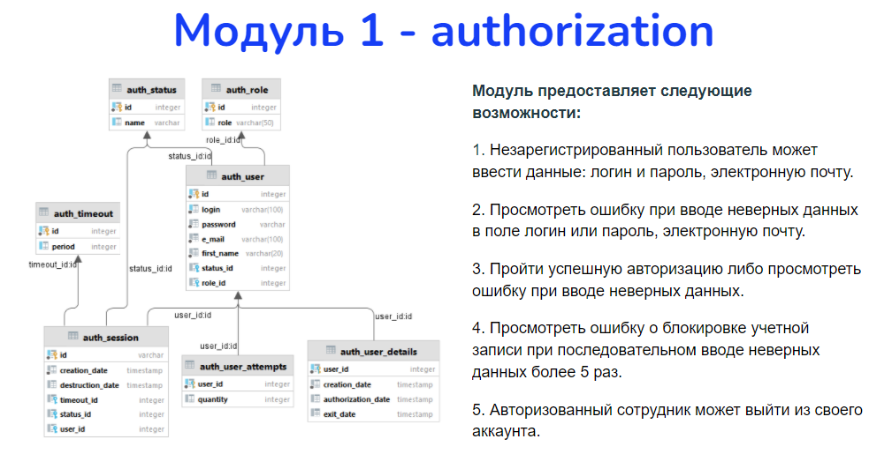
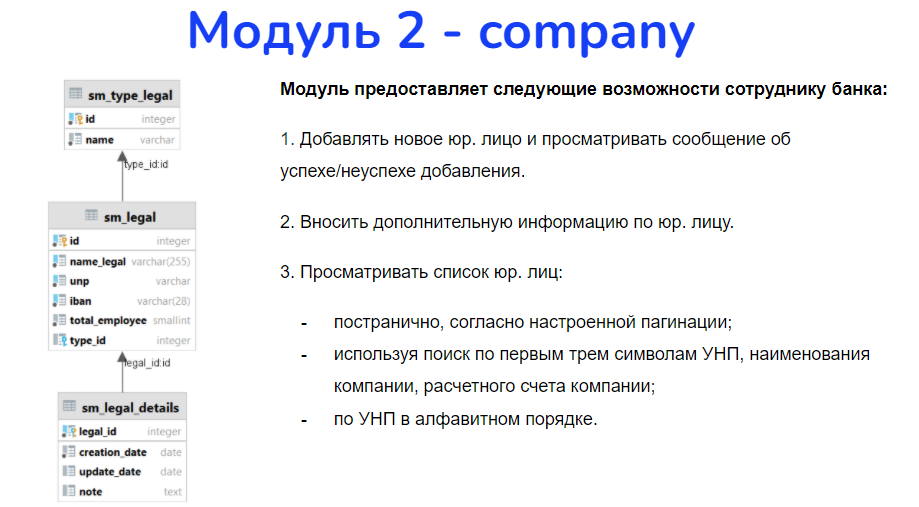
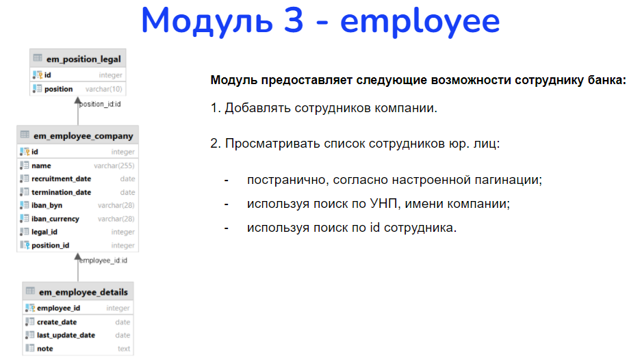
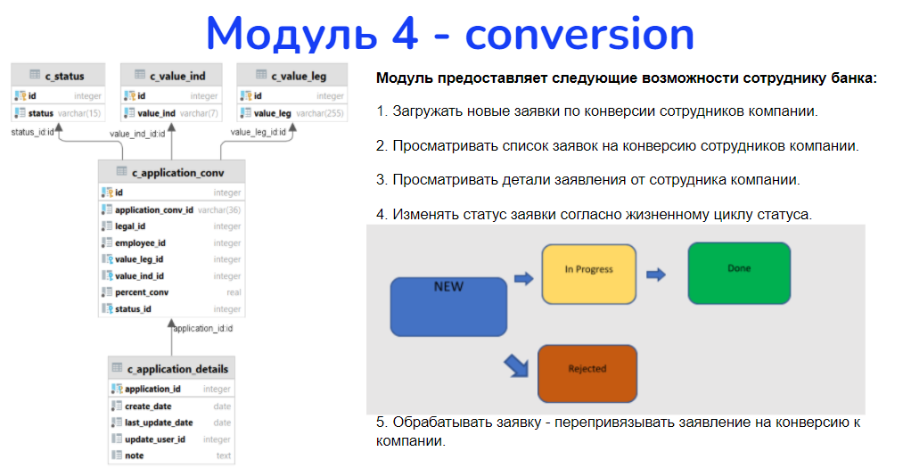
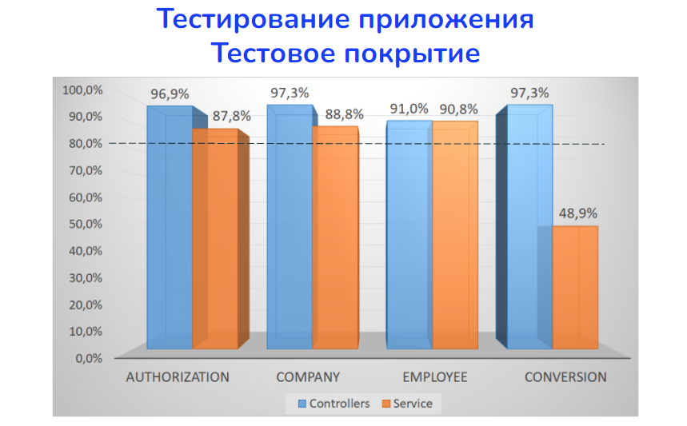

### Final project - [watch defense](https://youtu.be/Tir7BtbbV_k?t=2726)
### Junior Java Developer
### Brutski-Stsempkouski Artur

### LinkedIn: [Profile](https://www.linkedin.com/in/artur-brutski-stsempkouski-aaa285211/)
### Telegram: @LastGogi

1. Module 1 provides the following features:
	- An unregistered user can enter data: login and password, e-mail.
	- View an error when entering incorrect data in the login or password field, e-mail.
	- Pass a successful authorization or view the error when entering incorrect data.
	- View an error about blocking an account when consecutively entering incorrect data more than 5 times.
	- An authorized employee can log out of their account.

2. Module 2 provides the bank employee with the following options:
	- Add a new legal entity and view the success/failure message of the addition.
	- Enter additional information on the legal entity.
	- View the list of legal entities:
		- page by page, according to the configured pagination;
		- using the search for the first three characters of the UNP, the name of the company, the company's current account;
		- by UNP in alphabetical order.

3. Module 3 provides the bank employee with the following options:
	- Add company employees.
	- View the list of employees of legal entities:
		- page by page, according to the configured pagination;
		- using search by UNP, company name;
		- using search by employee id.

4. Module 4 provides the bank employee with the following options:
	- Upload new applications for the conversion of company employees.
	- View the list of applications for the conversion of company employees.
	- View application details from a company employee.
	- Change the status of the application according to the life cycle of the status.
	- Process the application - relink the conversion application to the company.

5. Test Coverage

